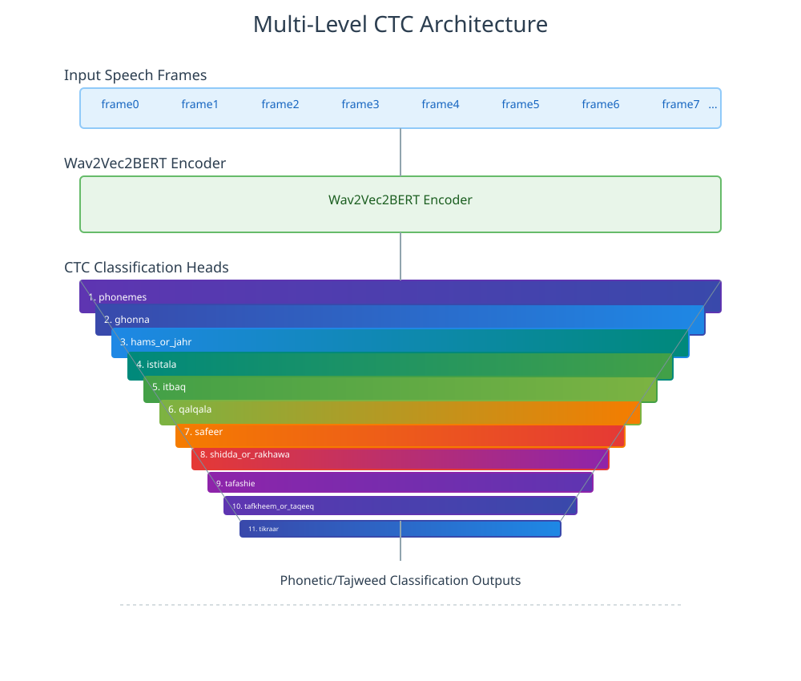

# Quran Muaalem

<div align="center">
<strong>بعون الله وتوفيقه لا شريك له نقدم العلم القرآني الذكي القادر على كشف أخطاء التلاوة والتجويد وصفات الحروف بدقة عالية</strong>

[![PyPI][pypi-badge]][pypi-url]
[![Python Versions][python-badge]][python-url]
[![Hugging Face Model][hf-model-badge]][hf-model-url]
[![Hugging Face Dataset][hf-dataset-badge]][hf-dataset-url]
[![Google Colab][colab-badge]][colab-url]
[![arXiv][arxiv-badge]][arxiv-url]
[![MIT License][mit-badge]][mit-url]

</div>

[pypi-badge]: https://img.shields.io/pypi/v/quran-muaalem.svg
[pypi-url]: https://pypi.org/project/quran-muaalem/
[mit-badge]: https://img.shields.io/github/license/obadx/quran-muaalem.svg
[mit-url]: https://github.com/obadx/quran-muaalem/blob/main/LICENSE
[python-badge]: https://img.shields.io/pypi/pyversions/quran-muaalem.svg
[python-url]: https://pypi.org/project/quran-muaalem/
[colab-badge]: https://img.shields.io/badge/Google%20Colab-Open%20in%20Colab-F9AB00?logo=google-colab&logoColor=white
[colab-url]: https://colab.research.google.com/drive/1-RuRQOj4l2MA_SG2p4m-afR7MAsT5I22?usp=sharing
[hf-model-badge]: https://img.shields.io/badge/%F0%9F%A4%97%20Hugging%20Face-Model-blue
[hf-model-url]: https://huggingface.co/obadx/muaalem-model-v3_0
[hf-dataset-badge]: https://img.shields.io/badge/%F0%9F%A4%97%20Hugging%20Face-Dataset-orange
[hf-dataset-url]: https://huggingface.co/datasets/obadx/muaalem-annotated-v3
[arxiv-badge]: https://img.shields.io/badge/arXiv-Paper-<COLOR>.svg
[arxiv-url]: https://arxiv.org/abs/<PAPER_ID>


## الممزيات

* مدرب على الرسم الصوتي للقhttps://huggingface.co/docs/transformers/model_doc/wav2vec2-bertرآن الكريم: [quran-transcript](https://github.com/obadx/quran-transcript) القادر على كشف أخطاء الحروف والتجويد وصفات الحروف
* نموذج معقول الحجم 660 MP 
* يحتاج فقط إله 1.5 GB من ذاكرة معالج الرسوميات
* معمارية مبتكرة: CTC متعدد المتويات

## المعمارية
معمارية مبتكرة: CTC متعدد المتويات. حيث كل مستوي يتدرب على وجه معين



## الخطوات المختصرة للتطوير

* تجميع التلاوت القرآنية من القراء المتقنين: [prepare-quran-dataset](https://github.com/obadx/prepare-quran-dataset)
* تقسيم التلاوت على حسب الوقف وليس الآية باستخدام [المقسم](https://github.com/obadx/recitations-segmenter)
* الحصو على النص القرآني من المقاطع الصوتية باسخدام [نموذج ترتيل](https://huggingface.co/tarteel-ai/whisper-base-ar-quran)
* تصحيح النصوص المستخرجة من ترتيل باستخدام  [خوارزمية التسمين](https://github.com/obadx/quran-transcript)
* تحويل الرسم الإملائي للرسم العثماني: [quran-transcript](https://github.com/obadx/quran-transcript)
* تحويل الرسم العثماني للرسم الصوتي للقرآني الكريم الذي يصف كل قواعي التجويد ما عدا الإشمام: [quran-transcript](https://github.com/obadx/quran-transcript)
* تدريب النموذج على معمارية [Wav2Vec2BERT](https://huggingface.co/docs/transformers/model_doc/wav2vec2-bert)


## استخدام النوذج


### استخدام النموذج عن طريق واجهة gradio

قم بتزيل  [uv](https://docs.astral.sh/uv/) 

```bash
pip install uv
```
أو
```bash
curl -LsSf https://astral.sh/uv/install.sh | sh
```

بعد ذلك قم بتنزيل `ffmpeg`

```bash
sudo apt-get update
sudo apt-get install -y ffmpeg
```

أو من خلال `anaconda`
```bash
conda install ffmpeg
```

قم بتشغيل `gradio` ب command واحد فقط:
```bash
uvx --no-cache --from https://github.com/obadx/quran-muaalem.git[ui]  quran-muaalem-ui
```
او
```bash
uvx quran-muaalem[ui]  quran-muaalem-ui
```

### عن طريق python API
